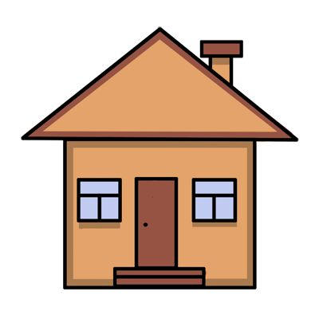
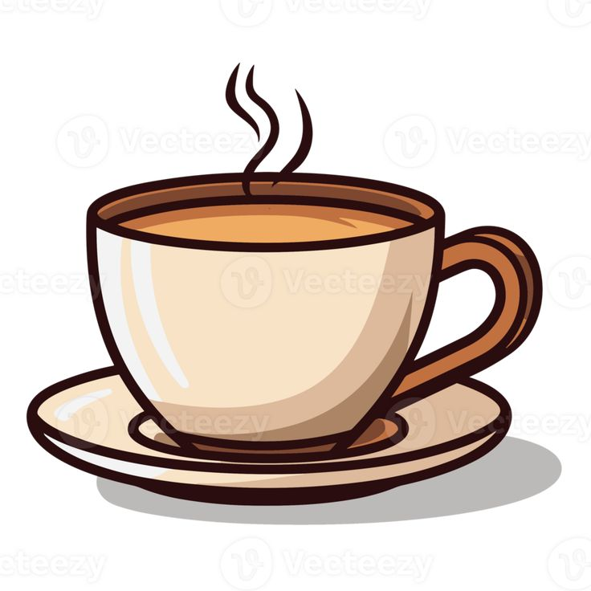

<html>
<head>

  <body>
<ul>
<h1 align = center> SELAMAT DATANG DI KOPI SENJA </h1>
 |
 |

</ul>

<h1 align = center> KEUNGGULAN KOPI SENJA </h1>
<ul>
  <li>Biji Kopi Pilihan dari Seluruh Nusantara</li>
  <li>Suasana Nyaman untuk Bekerja dan Bersantai</li>
  <li>Tersedia Wi-Fi Cepat</li>
  <li>Area Indoor dan Outdoor</li>
</ul>

<h1>JAM OPERASIONAL</h1>
<table cellspacing = 2 cellpadding = 2 border="1">
  <tr>
    <th>Hari</th>
    <th>Jam Buka - Tutup</th>
  </tr>
  <tr>
    <td>Senin - Jumat</td>
    <td>08:00 - 22:00 WIB</td>
  </tr>
  <tr>
    <td>Sabtu - Minggu</td>
    <td>09:00 - 23:00 WIB</td>
  </tr>
</table>
 
<a href="revervasi.html">PESAN MEJA ANDA SEKARANG</a>
 
</html>
</body>
</head>
